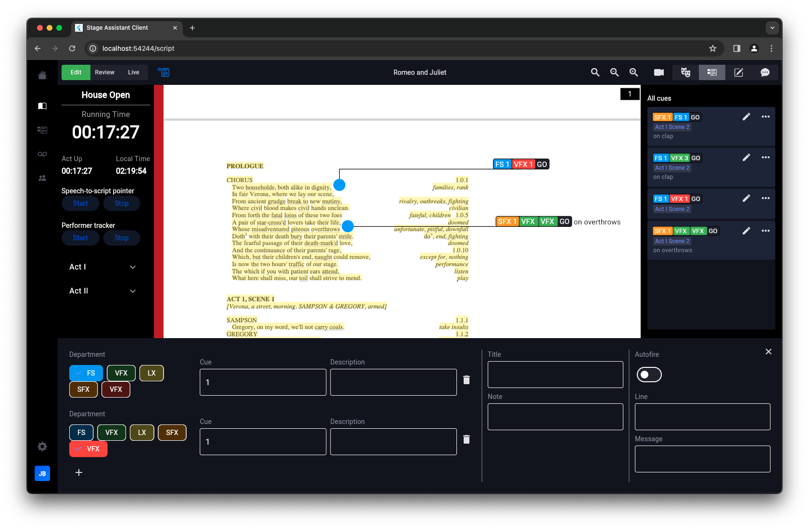

# Stage Assistant

This repository contains the complete codebase for the Stage Assistant application, including both the backend and frontend components.

Stage assistant is a real-time performer and script tracking tool for the performing arts. It provides the following key features:
- Tracking the current location of a live performance in a script in real-time using speech recognition and NLP.
- Tracking the current location of performers on stage in real-time, identifying them and providing coordinates in 3D space using solely a 2D video input.
- A collaborative script annotation tool, designed for the demands of live performenaces.

NOTE: This project is still in development.




## Repository Structure

- `/Backend`: Contains the code for the backend of the Stage Assistant application.
- `/Frontend`: Contains the code for the frontend of the Stage Assistant application.

## Setup Instructions

### Prerequisites

Ensure you have the following installed on your system:
- Git
- Node.js and npm
- Python 3.12
- Flutter SDK
- Dart SDK

### Cloning the Repository

Clone the master repository to your local machine:
```bash
git clone https://github.com/jackbeau/masters
cd stage-assistant
```

## Backend and Frontnd Setup

Navigate to the backend and frontend directories and follow the setup instructions
